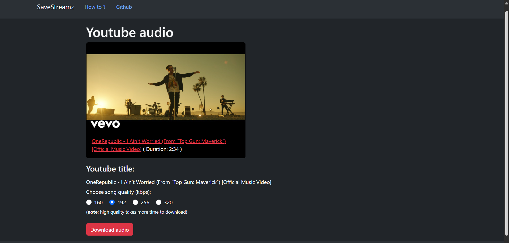

# SaveStreamz

A webapp that is used to download Spotify playlist/album/track or Youtube audio.


## Tech Stack

**Frontend:** HTML, CSS(Bootstarp)

**backend:** Python(Django), Sqlite3


## Environment Variables

To run this project, you will need to add the following environment variables to your .env file inside django app(webpage in this case).

`CLIENT_ID` - from spotify dashboard

`CLIENT_SECRET` - from spotify dashboard


## Installation

Install all the required packages using `pip`
```bash
  > pip install -r requirements.txt
```

Run the django project with environment activated:
```bash
    > python manage.py runserver
```

## Screenshots

<details><summary>Home page</summary>

</details>

<details><summary>Youtube download page</summary>

</details>

<details><summary>Spotify playlist page</summary>

</details>

<details><summary>Spotify playlist mobile view</summary>

</details>
